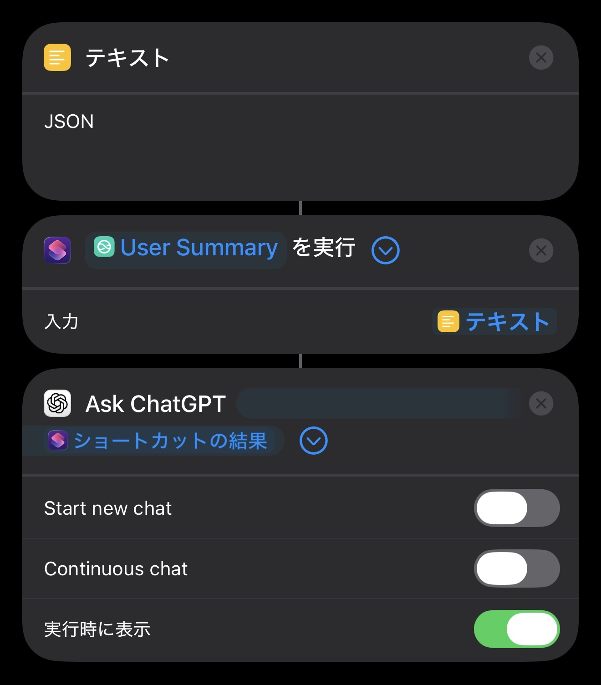

# Apple Intelligence非対応機種向けガイド 
Apple Intelligence を使えない iPhone 14 Pro や iPhone 15 などのデバイスでは、利用前にひと工夫が必要です。 
このガイドでは、代替の生成AIを使って User Summary を活用する方法を説明します。

## 注意点 ⚠️
- 🔐 代替AIサービスの利用規約・プライバシーポリシーを必ず確認してください。
- 🔥 実行中に発熱・処理遅延・エラーが起こる可能性があります。
- 💸 一部サービスはAPI利用料が発生します。
- 📶 クラウド型AIは通信環境に依存します。機微情報の扱いに注意してください。

## 準備するもの 🧰
- 生成AIサービス（ローカル or クラウド）
- 必要に応じて API キー
- iOS/iPadOS/macOS のショートカットアプリ

## サービスの選び方 🔍
- ローカル重視（オフライン/プライバシー優先）: [Locally AI](https://locallyai.app/)
- 精度・安定性重視（オンライン）: [ChatGPT](https://chat.openai.com/) など

## 手順 ▶️
1) User Summary を JSON 引数で実行
- ショートカットから本ショートカットを引数「JSON」で呼び出します。
- この場合、連絡先/予定/現在地/天気/デバイス情報を JSON で取得のみ行います。

2) 生成AIに送信する
- ショートカットの出力を、そのまま生成AIに送信します。

3) 結果を表示する
- 通知/表示/読み上げなど、好みの出力方法を選びます。

## ショートカット構成例 🧩
1. 「User Summary」を引数「JSON」で実行
2. 取得した JSON を選んだAIへ送信
3. 返ってきた要約を通知・表示・読み上げ

参考図:

