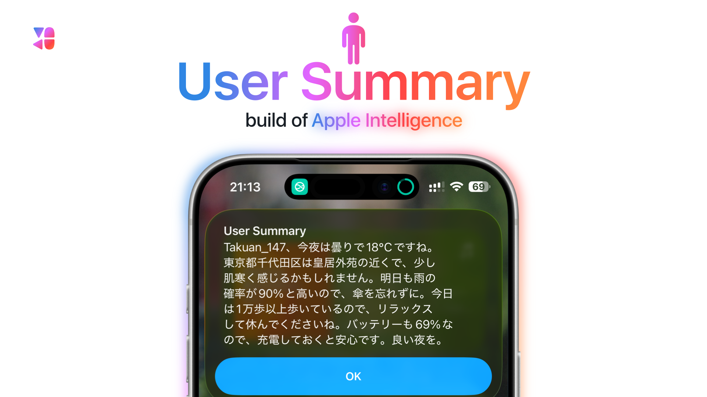

# User Summary 🧠📲
Apple Intelligenceを活用した、ユーザーの今の情報を要約するショートカットです。✨📝 

## 対応機種 📱💻
- iOS/iPadOS/macOS 26.1以降を搭載したApple Intelligence対応デバイス
- ※非対応でも動作できる可能性があります

### ⚠️ Apple Intelligence非対応デバイスをご利用の方
A16 Bionic以前のデバイスや、Intel搭載Mac等ではApple Intelligenceが使用できません。別途準備が必要です。 
→ 手順は[こちら](./for-nonAppleIntelligence-Devices.md)

## インストール ⬇️
ショートカットを入手: https://www.icloud.com/shortcuts/bb4872a9aa254efd9cf8150434b66169

## 使い方 ▶️
1. 上のリンクからショートカットをインストールします。
2. 初回起動で初期設定が始まります。 
   - 連絡先の選択で「自分の連絡先」を選びます。 
   - 位置情報の使用を許可します。 
3. 初期設定が完了するとショートカットが実行され、要約が生成されます。

## 引数 ⚙️
- 🤖 Automation: 自動実行向け。引数に「Automation」を指定すると、アラートを使用せず通知で要約を表示します。 
- 🧾 JSON: 情報収集のみ。引数に「JSON」を指定すると、要約せず収集データをJSON形式で出力します。 
- 🛠️ Debug: デバッグモード。引数に「Debug」を指定します。 
- 🗣️ Siri: Siriからの実行。引数に「Siri」を指定すると、通知で要約を表示し、その内容を読み上げます。 

## カスタマイズ 🎛️
ショートカット内の上部にある辞書などを編集することで、表現や挙動を好みに合わせて変更できます。

## 利用規約 / プライバシーポリシー 📜
このショートカットを利用して何らかの問題が発生した場合でも、私 Takuan_147 は一切の責任を負いません。 

このショートカットを実行しても、私 Takuan_147 には一切情報が送信されません。 
ユーザーの情報を取得し、その情報を元に要約を生成しますが、その情報は全て Apple のオンデバイスまたはプライベートクラウドコンピューティング上で処理されます。 
使用する場合は [iCloud 利用規約](https://www.apple.com/jp/legal/internet-services/icloud/jp/terms.html) と、[Apple Intelligence のプライバシーポリシー](https://www.apple.com/jp/legal/privacy/data/ja/intelligence-engine/) に同意したものとみなします。 
同意できない場合は使用しないでください。
